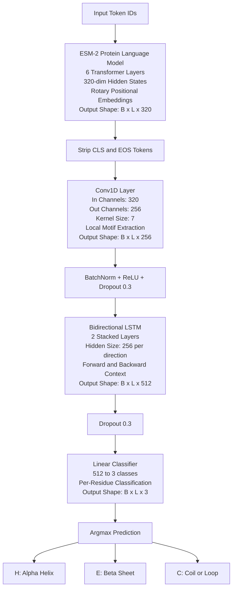
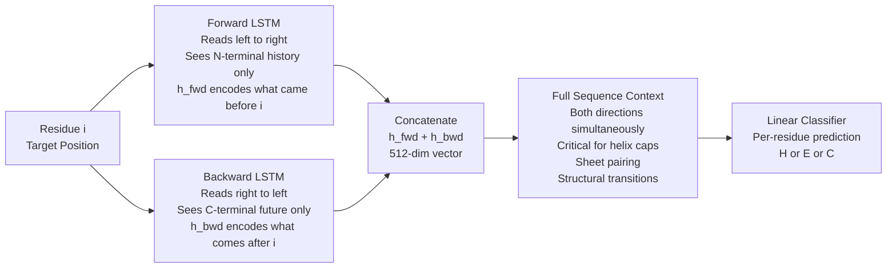
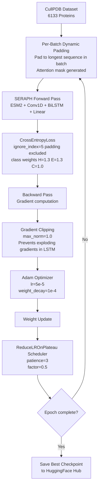
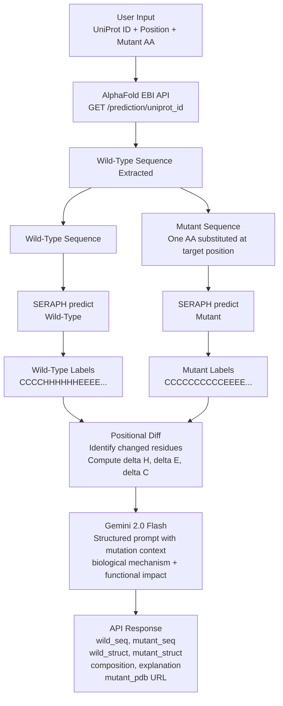
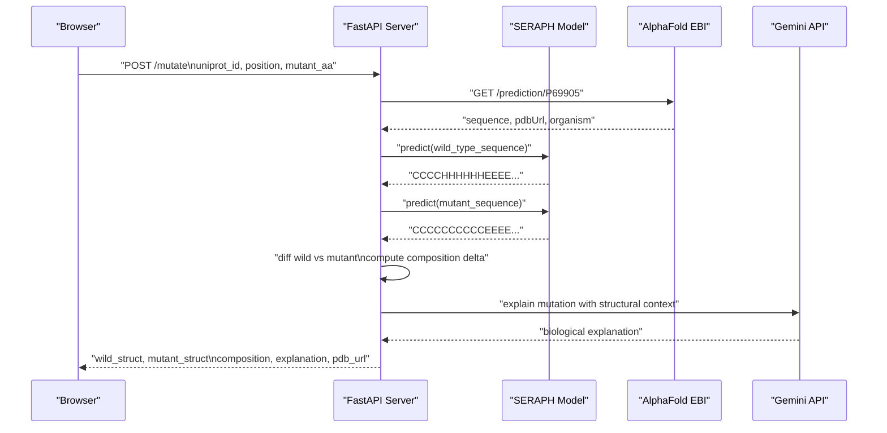

# MutantScope — System Architecture

## Overview

MutantScope is an end-to-end protein mutation analysis platform that combines a custom deep learning model (SERAPH) with structural biology APIs and generative AI to predict and explain the secondary structure consequences of amino acid substitutions.

---

## SERAPH — Model Architecture

**SERAPH** (Secondary Structure Recognition and Prediction Hub) is an original deep learning model trained from scratch for Q3 secondary structure prediction — classifying each residue in a protein sequence as one of three structural states:

| Label | Class | Description |
|-------|-------|-------------|
| `H` | Alpha Helix | Coiled spring conformation stabilized by i→i+4 hydrogen bonds |
| `E` | Beta Sheet | Extended zigzag strands connected by inter-strand H-bonds |
| `C` | Coil/Loop | Flexible, unstructured regions with no defined periodicity |

---

### 1. SERAPH Forward Pass



---

### Architecture Design Rationale

**Why ESM-2 as the backbone?**

Raw amino acid one-hot encoding treats each residue as an independent symbol with no chemical context. ESM-2 is a protein language model trained on 250M+ sequences — its embeddings encode evolutionary, physicochemical, and structural information implicitly. Using ESM-2 representations as input means SERAPH begins with embeddings that already "understand" amino acid chemistry before any task-specific learning occurs.

**Why Conv1D before the BiLSTM?**

Secondary structure is locally determined to a significant degree — an alpha helix has characteristic backbone dihedral angles across a window of ~4 residues. The Conv1D layer with `kernel_size=7` explicitly models this locality before the BiLSTM captures long-range context.

**Why Bidirectional LSTM?**

The structural class of residue `i` is influenced by residues both N-terminal and C-terminal to it. A BiLSTM reads the sequence in both directions and concatenates the hidden states, giving every position full-sequence context before classification.

**Why 2 LSTM layers?**

The first BiLSTM layer learns low-level sequential patterns. The second learns higher-order abstractions — combinations of motifs and domain-level patterns.

---

### 2. BiLSTM Bidirectional Context Window



---

### Training Configuration

| Hyperparameter | Value |
|---|---|
| Dataset | CullPDB (training) + CB513 (test) |
| Training samples | ~6,000 proteins |
| Optimizer | Adam (`lr=5e-5`, `weight_decay=1e-4`) |
| Loss function | CrossEntropyLoss with class weights `[1.3, 1.3, 1.0]` |
| Gradient clipping | `max_norm=1.0` |
| LR scheduler | ReduceLROnPlateau (`patience=3`, `factor=0.5`) |
| Epochs | 15 |
| Batch size | 32 |
| Padding strategy | Per-batch dynamic padding via `collate_fn` |
| Padding label | `ignore_index=5` |
| ESM-2 freezing | All layers frozen except last 2 transformer blocks |

---

### 3. Training Data Flow



---

### Performance

| Metric | Value |
|---|---|
| Q3 Train Accuracy | 79.34% |
| Q3 Test Accuracy (CB513) | 75.31% |
| Helix Precision / Recall | 0.82 / 0.80 |
| Sheet Precision / Recall | 0.63 / 0.81 |
| Coil Precision / Recall | 0.79 / 0.68 |
| Trainable Parameters | 3,205,379 |

---

## Mutation Analysis Pipeline

### 4. Wild-Type vs Mutant Analysis Flow



---

## System Architecture

### 5. End-to-End Request Lifecycle



---

## Technology Stack

| Layer | Technology | Rationale |
|---|---|---|
| Model framework | PyTorch 2.x | Dynamic computation graphs, research-standard |
| Protein LM | ESM-2 (HuggingFace Transformers) | State-of-the-art protein embeddings |
| Backend | FastAPI | Async, automatic OpenAPI docs, Pydantic validation |
| Package manager | uv | 10-100x faster than pip |
| Frontend | Next.js 15 + TypeScript | App Router, server components, type safety |
| Runtime | Bun | Faster installs and dev server than Node |
| Styling | Tailwind CSS v4 + CSS variables | Utility-first with design token consistency |
| Animation | Framer Motion | Production-grade animation primitives |
| Generative AI | Gemini 2.0 Flash | Fast, cost-effective, scientifically literate |
| Model hosting | HuggingFace Hub | Standard ML model registry |
| Containerization | Docker + Compose | Environment parity across dev and production |

---

## Model Hosting

SERAPH weights are hosted publicly on HuggingFace Hub at `PypCoder/SERAPH`. The server downloads weights on cold start via `huggingface_hub.hf_hub_download()` and caches them locally. The model is loaded as a singleton — subsequent requests reuse the in-memory model without re-loading.

```python
# singleton pattern — model loaded once per server process
_model     = None
_tokenizer = None

def load_seraph():
    global _model, _tokenizer
    if _model is not None:
        return _model, _tokenizer
    # ... load from HF Hub
```

---

## Parameter Count Breakdown

| Layer | Parameters |
|---|---|
| ESM-2 last 2 layers (trainable) | ~2,600,000 |
| Conv1D(320→256, k=7) | 573,440 |
| BatchNorm1d(256) | 512 |
| BiLSTM Layer 1 (fwd+bwd) | ~524,800 |
| BiLSTM Layer 2 (fwd+bwd) | ~786,432 |
| Linear(512→3) | 1,539 |
| **Total Trainable** | **3,205,379** |

---

## Limitations and Future Work

| Limitation | Impact | Planned Fix |
|---|---|---|
| Max sequence length 512 tokens | Truncates long proteins | Sliding window inference |
| No MSA features | ~10% Q3 accuracy gap vs SOTA | Add evolutionary profiles as input features |
| ESMFold API unavailable | No mutant 3D structure rendering | Self-host ESMFold or use OpenFold |
| Single mutation only | Can't analyze compound mutations | Extend API to accept mutation list |
| Q3 accuracy 75.31% | Structural predictions have error margin | Fine-tune on larger dataset with MSA |
